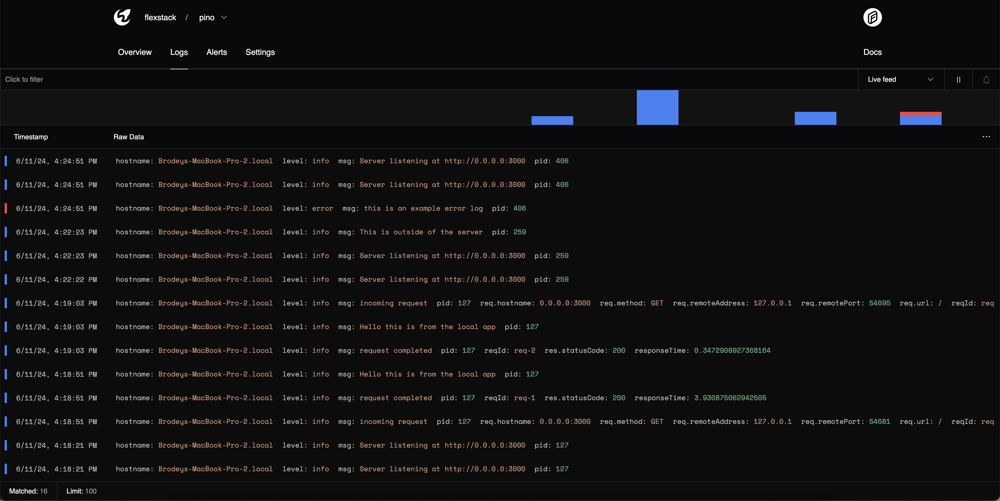

## Quickstart

Install the `@moonbasehq/pino` package

```bash
pnpm i --save @moonbasehq/pino
```

Create your pino logger

```typescript
import pino from 'pino';

const transport = pino.transport({
  targets: [
    {
      target: '@moonbasehq/pino',
      options: {
        projectId: 'clxaua3q10004zg0q5p7qvjyj',
        apiKey: 'moonbase_...',
      },
    },
    // you can use pino-pretty to pipe to stdout alongside Moonbase
    {
      target: 'pino-pretty',
      options: {
        colorize: true,
        translateTime: 'HH:MM:ss Z',
        ignore: 'pid,hostname',
      },
    }
  ],
  dedupe: true,
});

const logger = pino(transport);

logger.info('Hello world')
```

## Usage with Fastify

```typescript
import fastify from 'fastify';
import pino from 'pino';

const transport = pino.transport({
  targets: [
    {
      target: '@moonbasehq/pino',
      options: {
        projectId: 'clxaua3q10004zg0q5p7qvjyj',
        apiKey: 'moonbase_...',
      },
    },
    {
      target: 'pino-pretty',
      options: {
        colorize: true,
        translateTime: 'HH:MM:ss Z',
        ignore: 'pid,hostname',
      },
    }
  ],
  dedupe: true,
});

const logger = pino(transport);

const server = fastify({
  logger,
});

server.get('/', async (request, reply) => {
  request.server.log.info('Hello this is from the local app');

  return { hello: 'world' };
});

const start = async () => {
  try {
    await server.listen(3000, '0.0.0.0');
    server.log.info(`Server listening at http://0.0.0.0:3000`);
  } catch (err) {
    server.log.error(err);
    process.exit(1);
  }
};

logger.error('this is an example error log');

start();
```

### Results

